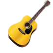

# Guitar Teacher Skill

This is an Alexa skill that provides instruction in how to play a guitar.



**Table of Contents**

- [Where are the graphics stored?](#graphics)
- [Where are the NLU models stored?](#nlu-models)
- [How does this skill play sound recordings?](#how-to-play-mp3-files-in-a-skill)

## Graphics

The Icons that are used in the Amazon Alexa skill store are found in the /graphics folder.
The notations for playing the different chords are stored in a folder in S3.
There is a naming notation to them that maps to the code within the skill.
This includes a suffix of -small.PNG vs. -large.PNG matching the format required by Alexa.

## NLU Models

The intent schema, custom slots, sample utterances, and other data attributes in the NLU models are stored in the /models folder.

## How to Play MP3 files in a Skill

Throughout this skill, the voice of Alexa is combined with guitar playing.
This is done using SSML - Speech Synthesis Markup Language.
An example of this is in the introduction. Here is the markup syntax that integrates the two.

```
var audioOutput = "<speak>";
    audioOutput = audioOutput +  "Welcome to Guitar Teacher.";
    audioOutput = audioOutput + "<audio src=\"https://s3.amazonaws.com/musicmakerskill/guitar/homeOnTheRange.mp3\" />";
    audioOutput = audioOutput + "Your tool for learning how to play the guitar. " + 
        "To get started, you can say Teach Notes, Teach Chords, Play Guitar, or Tune Guitar. " +
        "If you want more detailed instructions, say Help.";
    audioOutput = audioOutput + "</speak>";

var repromptText = "Please start by saying something like Play Guitar";
buildAudioResponse(cardTitle, audioOutput, cardOutput, repromptText, shouldEndSession));
```

The markup needs to have "<speak>" notated to indicate that SSML will be used.
Then within the SSML, use the markup <audio src="https://s3.aws.../file.mp3"> to provide the location of the mp3 file.

For an example of a skill using the current version of the NodeJS SDK, please use [this repo](https://github.com/terrenjpeterson/pianoplayer).
